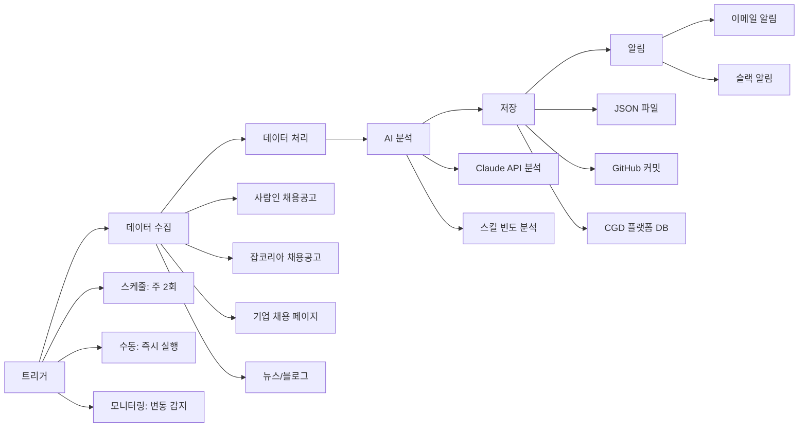

# Firecrawl 자동화 워크플로우

---

## 자동화 시스템 전체 구조



---

## GitHub Actions 자동화 스케줄

```yaml
# .github/workflows/auto-collect.yml

name: 채용공고 자동 수집

on:
  schedule:
    - cron: '0 8 * * 1'   # 매주 월요일 오전 8시
    - cron: '0 8 * * 4'   # 매주 목요일 오전 8시
  workflow_dispatch:

jobs:
  collect:
    runs-on: ubuntu-latest
    steps:
      - uses: actions/checkout@v4
      
      - name: Python 설정
        uses: actions/setup-python@v5
        with:
          python-version: '3.11'
      
      - name: 패키지 설치
        run: pip install firecrawl-py anthropic python-dotenv
      
      - name: 채용공고 수집
        env:
          FIRECRAWL_API_KEY: ${{ secrets.FIRECRAWL_API_KEY }}
          ANTHROPIC_API_KEY: ${{ secrets.ANTHROPIC_API_KEY }}
        run: python scripts/collect_jobs.py
      
      - name: 결과 커밋
        run: |
          git config user.name 'CGD Auto Bot'
          git config user.email 'bot@cgd.edu'
          git add data/
          git diff --staged --quiet || git commit -m "자동 수집: $(date '+%Y-%m-%d')"
          git push
```

---

## 운영 현황 모니터링

```python
# 자동화 시스템 상태 확인
def check_automation_status():
    import os
    import glob
    from datetime import datetime, timedelta
    
    # 최근 수집 파일 확인
    files = sorted(glob.glob("data/jobs/*.json"), reverse=True)
    
    if not files:
        print("경고: 채용공고 데이터 없음!")
        return
    
    latest_file = files[0]
    file_time = os.path.getmtime(latest_file)
    file_date = datetime.fromtimestamp(file_time)
    
    days_old = (datetime.now() - file_date).days
    
    if days_old > 4:
        print(f"경고: 마지막 수집이 {days_old}일 전! 수집 오류 확인 필요")
    else:
        print(f"정상: 마지막 수집 {days_old}일 전 ({file_date.strftime('%Y-%m-%d')})")
    
    print(f"파일 수: {len(files)}개")

check_automation_status()
```

---

*CGD AI Career Platform - workflow/Firecrawl.md*
