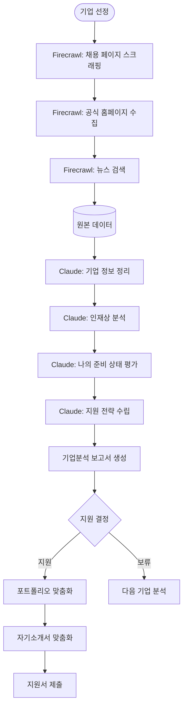

# Firecrawl + Claude 기업분석 워크플로우

---

## 기업분석 자동화 플로우



---

## 실행 스크립트

```python
# 통합 기업분석 스크립트
# scripts/analyze_company_full.py

from firecrawl import FirecrawlApp
import anthropic
import os, json
from datetime import datetime
from dotenv import load_dotenv

load_dotenv()

def analyze_company(company_name, company_url):
    """기업 전체 분석 파이프라인"""
    
    firecrawl = FirecrawlApp(api_key=os.getenv("FIRECRAWL_API_KEY"))
    claude = anthropic.Anthropic(api_key=os.getenv("ANTHROPIC_API_KEY"))
    
    print(f"\n[{company_name}] 분석 시작...")
    
    # Step 1: 데이터 수집
    print("  1. 채용 페이지 수집 중...")
    scraped = firecrawl.scrape_url(
        url=company_url,
        params={'formats': ['markdown'], 'onlyMainContent': True}
    )
    raw_content = scraped.get('markdown', '')[:5000]
    
    # Step 2: 뉴스 검색
    print("  2. 최신 뉴스 검색 중...")
    news = firecrawl.search(
        query=f"{company_name} 최신 뉴스 채용 2026",
        params={'limit': 3, 'lang': 'ko'}
    )
    news_summary = "\n".join([r.get('description', '') for r in news.get('data', [])])
    
    # Step 3: Claude 분석
    print("  3. Claude AI 분석 중...")
    message = claude.messages.create(
        model="claude-opus-4-5",
        max_tokens=2000,
        messages=[{
            "role": "user",
            "content": f"""
{company_name} 기업분석을 해주세요.

채용 페이지 내용:
{raw_content}

최신 뉴스:
{news_summary}

분석 항목:
1. 기업 핵심 키워드 3개
2. 디자인 직군 현황
3. 인재상 분석
4. 신입 지원 시 포트폴리오 포인트
5. 자기소개서 키워드 5개
6. 지원 추천 점수 (10점) + 이유

JSON 형식으로 반환해주세요.
"""
        }]
    )
    
    analysis = message.content[0].text
    
    # Step 4: 보고서 생성
    report = f"""# {company_name} 기업분석 보고서
생성일: {datetime.now().strftime("%Y년 %m월 %d일")}

## 수집 원본 데이터 (Firecrawl)
{raw_content[:2000]}...

## Claude AI 분석 결과
{analysis}
"""
    
    os.makedirs("reports/companies", exist_ok=True)
    filename = f"reports/companies/{company_name}_{datetime.now().strftime('%Y%m%d')}.md"
    with open(filename, 'w', encoding='utf-8') as f:
        f.write(report)
    
    print(f"  완료! {filename}")
    return report

if __name__ == "__main__":
    analyze_company("카카오", "https://careers.kakao.com")
```

---

## 소요 시간 및 비용 예상

| 단계 | 소요 시간 | Firecrawl 크레딧 | 비용 |
|------|---------|----------------|------|
| 채용 페이지 수집 | 5~10초 | 1 크레딧 | ~$0.01 |
| 뉴스 검색 | 3~5초 | 3 크레딧 | ~$0.03 |
| Claude 분석 | 10~20초 | - | ~$0.05 |
| 보고서 생성 | 1초 | - | - |
| **합계 (기업 1곳)** | **약 30초** | **4 크레딧** | **~$0.09** |

---

*CGD AI Career Platform - workflow/기업분석.md*
