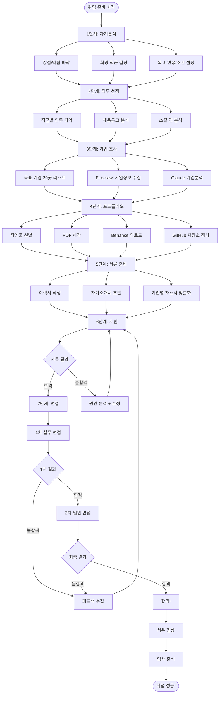

# 취업 준비 전체 플로우

## 개요
자기분석부터 최종 합격까지의 완전한 취업 준비 과정을 시각화합니다.

---

## 전체 취업 플로우 (Mermaid)



---

## 단계별 상세 가이드

### 1단계: 자기분석

**체크리스트**
```
[ ] MBTI/애니어그램 등 성향 파악
[ ] 가장 즐거웠던 작업 경험 3가지
[ ] 가장 힘들었던 경험 + 어떻게 극복했나
[ ] 10년 후 어떤 디자이너가 되고 싶은가
[ ] 연봉, 위치, 규모, 분야 우선순위 결정
```

**Claude 활용**
```
프롬프트:
"나의 경험을 바탕으로 적합한 디자인 직군을 추천해주세요.
경험: [경험 나열]
좋아하는 것: [좋아하는 것]
잘하는 것: [잘하는 것]"
```

---

### 3단계: 기업 조사 플로우

```
Firecrawl로 수집
    ↓
Claude로 분석
    ↓
기업분석 보고서 (template/기업분석.md)
    ↓
목표 기업 20곳 → 우선순위 10곳 → 실제 지원 5곳
```

---

### 5단계: 서류 준비 타임라인

```
Week 1: 이력서 기본 완성
Week 2: 자기소개서 초안 + Claude 피드백
Week 3: 기업별 자소서 맞춤화 (3개 이상)
Week 4: 최종 검토 + 제출 준비
```

---

## 합격률 높이는 전략

```
1. 지원 수 vs 질: 5~10곳에 집중 (100곳 지원보다 10곳 맞춤이 낫다)
2. 포트폴리오 선행: 서류 내기 전 포트폴리오 완성
3. 피드백 루프: 불합격 → 원인 분석 → 수정 → 재지원
4. 네트워크: 졸업생/선배 통한 추천 적극 활용
5. 타이밍: 공채 시즌(3~4월, 9~10월) + 수시채용 병행
```

---

*CGD AI Career Platform - workflow/취업.md*
