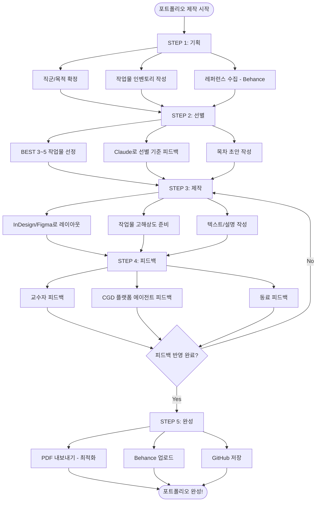

# 포트폴리오 제작 플로우

---

## 포트폴리오 제작 전체 과정



---

## 제작 단계별 체크리스트

### STEP 1: 기획 체크
```
[ ] 희망 직군 최종 확정
[ ] 작업물 인벤토리 10개 이상 작성
[ ] Behance에서 레퍼런스 20개 수집
[ ] 내 포트폴리오 방향성 결정 (키워드 3개)
```

### STEP 2: 선별 체크
```
[ ] BEST 프로젝트 3~5개 선정 완료
[ ] 각 프로젝트 선정 이유 설명 가능
[ ] 목차 완성 (페이지 배분 포함)
[ ] Claude 피드백 반영
```

### STEP 3: 제작 체크
```
[ ] 표지 완성
[ ] 자기소개 페이지 완성
[ ] 프로젝트 1 완성 (과정 포함)
[ ] 프로젝트 2 완성
[ ] 프로젝트 3 완성
[ ] 스킬 페이지 완성
[ ] 연락처 페이지 완성
[ ] 전체 디자인 통일성 확인
```

---

## 포트폴리오 퀄리티 기준

| 기준 | 하 (불합격) | 중 (통과) | 상 (합격 유력) |
|------|-----------|---------|-------------|
| 완성도 | 미완성 작업 포함 | 모두 완성 | 세부까지 완성 |
| 과정 설명 | 결과물만 | 과정 일부 | 전체 과정 + 이유 |
| 통일성 | 각 페이지 제각각 | 비슷한 느낌 | 일관된 시스템 |
| 분량 | 5p 이하 또는 40p+ | 15~25p | 20~28p |
| 포트폴리오 URL | 없음 | PDF만 | 링크 + PDF |

---

*CGD AI Career Platform - workflow/포트폴리오.md*
