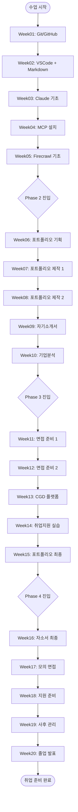
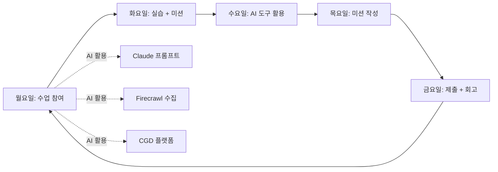
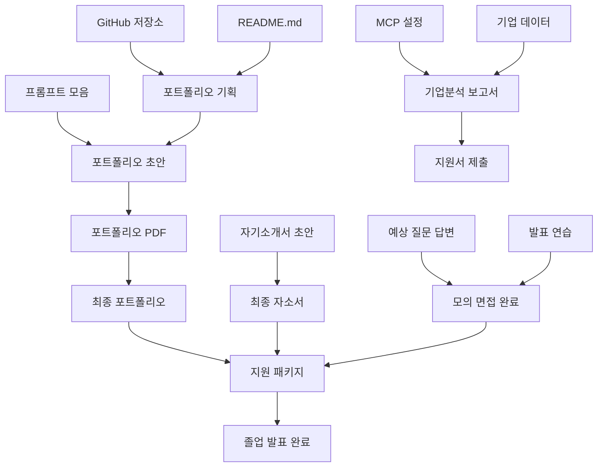

# 학생 학습 플로우 - 20주 전체 워크플로우

## 개요
CGD AI Career Platform 기반 20주 학습 과정의 전체 흐름을 시각화합니다.

---

## 전체 학습 플로우 (Mermaid 다이어그램)



---

## 주차별 학습 루프 (매주 반복)



---

## 산출물 흐름도



---

## 각 주차 학습 루틴

### 수업일 (주 1~2회)

```
10:00  수업 시작 - 지난 주 미션 공유 및 피드백
10:30  이번 주 이론 강의 (30~45분)
11:15  실습 시간 (45분~1시간)
12:00  점심
13:00  실습 마무리 + 질문 해결
13:30  다음 주 미션 안내
14:00  수업 종료
```

### 자습일 (수업 외 시간)

```
Day 1 (수업 다음 날)
  - 수업 내용 복습 (30분)
  - 실습 완성 (1시간)

Day 2~3
  - 미션 작성 시작 (2~3시간)
  - Claude AI로 피드백 받기 (1시간)
  - CGD 플랫폼 에이전트 활용 (30분)

Day 4 (미션 마감 전날)
  - 미션 최종 점검 (1시간)
  - GitHub push 확인
  - CGD 플랫폼 제출
```

---

## CGD 플랫폼 학습 연계 흐름

```
CGD 플랫폼 (cgdplatform-pm7dnqip.manus.space)
│
├── 학생 로그인
│   ├── 내 현황 대시보드
│   │   ├── 주차별 진행률
│   │   └── 취업 준비 점수
│   │
│   ├── 에이전트 메뉴
│   │   ├── 포트폴리오 첨삭 에이전트 → 피드백
│   │   ├── 자기소개서 작성 에이전트 → 초안
│   │   ├── 기업분석 에이전트 → 보고서
│   │   └── 면접 준비 에이전트 → 모의 면접
│   │
│   ├── 채용공고 메뉴
│   │   ├── 직군별 필터
│   │   ├── 지역별 필터
│   │   └── 관심 공고 저장
│   │
│   └── 진로지도 카드
│       ├── 자기 평가 작성
│       └── 교수자 공유
│
└── 교수자 확인
    ├── 학생별 진행 현황
    ├── 피드백 작성
    └── 취업 현황 업데이트
```

---

*CGD AI Career Platform - workflow/학생학습.md*
